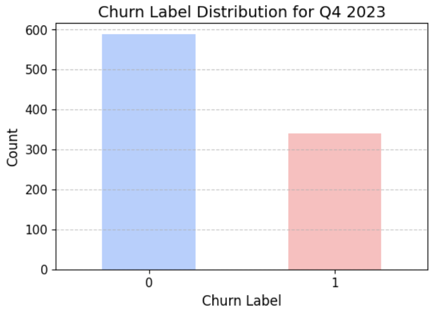
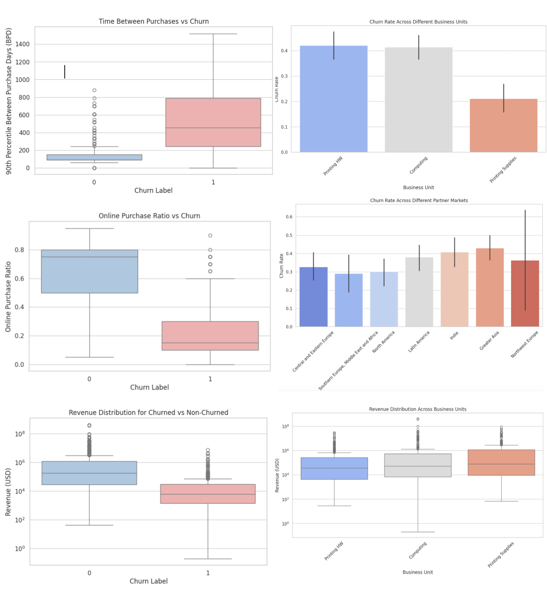
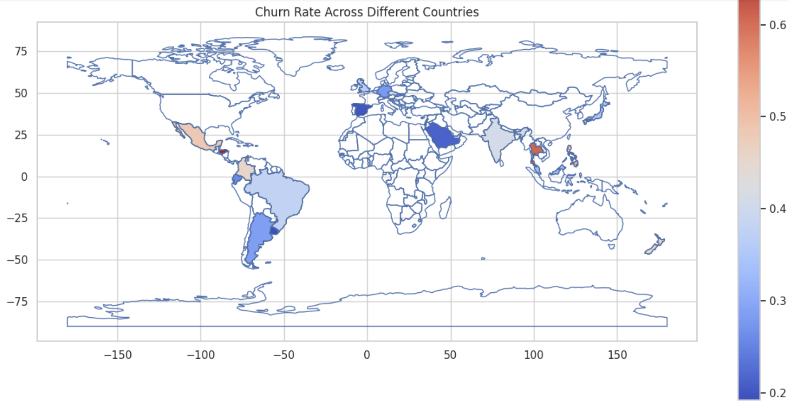
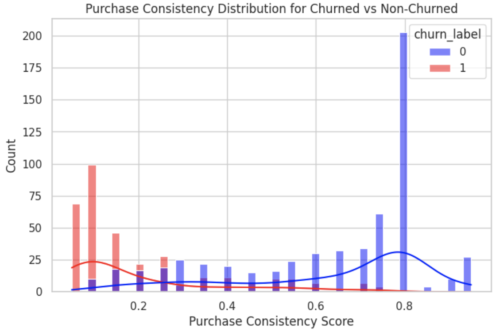
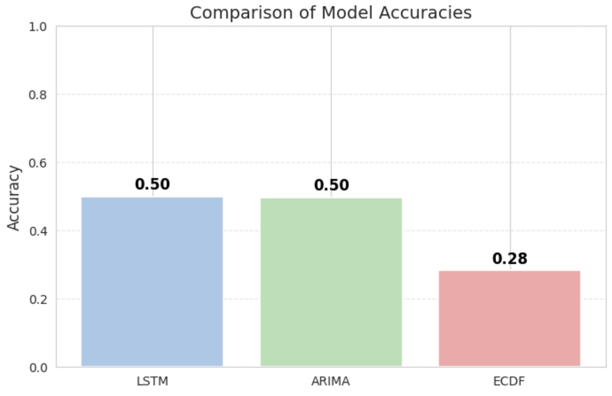
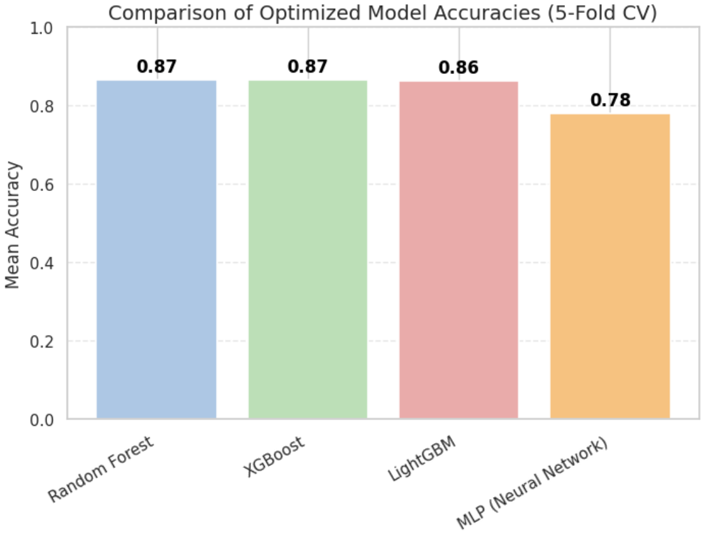

# 🔄 Customer Churn Prediction for a Printing Company (Non-Contractual Basis)

## 📌 Project Overview
This project aims to predict **customer churn** for a **printing company** using **sales transaction data (2018-2022)**. The objective is to:
- Identify **customers likely to churn** in 2023.
- Compare different **churn prediction methodologies**:
  - **Forecasting models** (ARIMA, LSTM)
  - **Empirical distribution-based method (ECDF)**
  - **Machine Learning (XGBoost, Random Forest)**

---

## **🗂️ Dataset**
- **Source**: Sales transaction data (370,000 records from 2018-2022).
- **Prediction Window**: Train on **2018-2022**, test on **Q4 2023**.
- **Key Features**:
  - **Customer ID - Product ID**: Unique combination treated as a "customer."
  - **Transaction history**: Purchase trends over time.
  - **Revenue & Purchase Frequency**: Key indicators of customer engagement.

📌 **Data Preprocessing Steps**
1. **Consolidated data into fiscal and calendar quarters** to ensure continuity.
2. **Aggregated transactions per Customer ID - Product ID combination**.
3. **Feature Engineering**:
   - Purchase frequency & recency
   - Churn probability indicators
4. **Feature Reduction** using **Random Forest feature importance**.

---

## **🛠️ Model Architectures**
### **1️⃣ Forecasting-Based Churn Detection**
| Model | Method | Accuracy |
|--------|------------------|------------|
| **ARIMA** | Forecasts future revenue for each customer. If **3 consecutive quarters** have **zero revenue**, it's classified as churned. | **50%** |
| **LSTM** | Uses deep learning for time-series forecasting. Same churn rule as ARIMA. | **50%** |

📌 **Findings**:
- Both **ARIMA & LSTM underperformed (50% accuracy)**.
- **Time-series models alone are insufficient** for churn prediction.

---

### **2️⃣ Empirical Cumulative Distribution Function (ECDF) Approach**
| Method | Definition | Accuracy |
|--------|------------|------------|
| **ECDF** | Customers in the **lowest 10% revenue percentile** are classified as churned. | **28%** |

📌 **Findings**:
- **ECDF method is not reliable for churn detection**.
- It **overclassifies churned customers**, leading to low accuracy.

---

### **3️⃣ Machine Learning-Based Churn Prediction (Best Model)**
| Model | Accuracy | Precision | Recall |
|--------|---------|-----------|--------|
| **Random Forest** | 87% | 0.86 | 0.88 |
| **XGBoost (Best Model)** | **87%** | **0.89** | **0.90** |
| **LightGBM** | 86% | 0.85 | 0.87 |
| **MLP (Neural Network)** | 78% | 0.76 | 0.80 |

📌 **Key Findings**:
- **XGBoost outperformed all other methods (87% accuracy).**
- **ECDF, ARIMA, and LSTM performed poorly** for non-contractual churn detection.
- **Machine Learning models were most effective** for prediction.

---

## **📊 Exploratory Data Analysis (EDA)**
### **Customer Churn Distribution**

### **Purchase Consistency Score vs Churn**

### **Churn Rate Across Business Units**

### **Churn Rate by Country**

📌 **Insights**:
- Customers with **lower purchase consistency** have **higher churn probability**.
- **Printing Supplies customers churn less** than those in **Printing HW**.
- **Churn rates vary significantly by region**.

---

## **📈 Model Performance Comparison**
### **Forecasting Models (ARIMA & LSTM)**

### **Machine Learning Models (XGBoost, RF, LightGBM)**

📌 **Key Insights**:
- **Time-series forecasting alone is not enough** for churn prediction.
- **Machine Learning (XGBoost) works best** in non-contractual churn settings.

---

## **🔍 Conclusion**
✅ **Best Model: XGBoost (87% accuracy)**.  
❌ **ARIMA, LSTM, and ECDF-based methods performed poorly**.  
🔄 **Next Steps**:
- Explore **deep learning-based classifiers** (e.g., Transformer-based models).
- Optimize feature selection & ensemble approaches.
